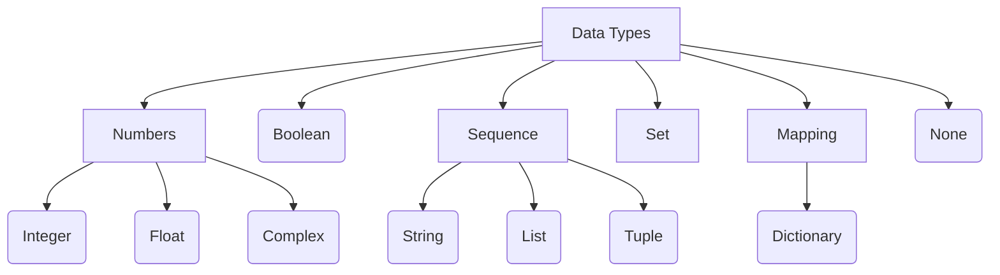

{{ page.content | number_of_words | divided_by:200 }} min read

* TOC
{:toc}

## Data Types in Python

## Operators in Python
### Mathematical/Arithmetic Operators

|Symbol|Description|Example 1|Example 2|
|------|-----------|---------|---------|
|+|Addition|>>> 55+45 100|>>> 'Good' + 'Morning' GoodMorning|
|-|Subtraction|>>> 55-45 10|>>> 30-80 -50|
|*|Multiplication|>>> 55*45 2475|>>> 'Good'*3 GoodGoodGood|
|/|Division|>>> 17/5 3.4|>>> 28/3 9.333333333333334|
|%|Remainder/Modulus|>>> 17%5 2|>>> 23%2 1|
|**|Exponentiation|>>> 2**3 8|>>> 16**.5 4.0|
|//|Integer Division (Floor Division)|>>> 7.0//2 3.0|>>> 3//2 1|

### Relational Operators

|Symbol|Description|Example: Integers|Example: Strings|
|------|-----------|---------|---------|
|<|less than|>>> 7<10 True|>>> 'Hello' < 'Goodbye' False|
|>|greater than|>>> 7>5 True|>>> 'Hello'>'Goodbye' True|
|<=|less than or equal to|>>> 2<=5 True|>>> 'Hello'<='Goodbye' False|
|>=|greater than or equal to|>>> 10>=10 True|>>> 'Hello'>='Goodbye' True|
|!=,<>|not equal to|>>> 10!=11 True|>>> 'Hello'!='HELLO' True|
|==|equal to|>>> 10==10 True|>>> 'Hello'=='Hello' True|

> **Note:** When relational operators are applied to strings, strings are compared left to right character by character, based on their ASCII codes, also called ASCII values.

### Logical Operators

|Symbol|Description|
|--|--|
|and|If both the operands/conditions are true, then the output becomes *True*.|
|or|If any one the operands/conditions is true, the the output become *True*.|
|not|Reverses the state of operand/condition.|

### Shorhand/Augmented Assignment Operators
**Note:** We assume the value of variable x as 12 for a better understanding of these operators.

|Operator|Description|Example|Result|
|--|--|--|--|
|+=|adds and assign back the result to left operand|x+=2|the operand/expression/constant written ofn RHS of operator will change the value of x to 14|
|-=|subtracts and assigns back the result to left operand|X-=2|x will become 10|
|*=|multiplies and assigns back the result to left operand|x*=2|x will become 24|
|/=|divides and assigns back the result to left operand|x/=2|x will become 6.0|
|%=|displays modulus using two operands and assigns the result to left operand|x%=2|x will become 0|
|**=|performs exponential (power) calculation on operators and assigns value to he left operand|x**=2|x will become 144|
|//=|performs floor division on operators and assigns value to the left operand|x//=2|x will become 6|

### Membership Operators
- ***in* operator:** It returns *True* if a character/substring exists in the given string.
- ***not in* operator:** It returns *True* if a character/substring does not exist in the given string.

### Identity Operators
- ***is* Operator:** It returns *True if both the variables are pointing to the same object. In other words, it evaluates *True* if the variables on either side of the operator point owards the same memory location; otherwise, it evaluates to *False*.
- ***is not* operator:** It returns *True* if both variables are not the same objects. In other words, it evaluates to *False* if the variables on either side of the operator point to the same memory location; otherwise, it evaluates to *True*.

## Summary

In this article we learned:

- Python data types
- Arithmetic operators
- Relational operators
- Logical operators
- Membership operators
- Identity operators

---
Next: [Python Variables and Input](#)
Previous: [Introduction to Python](#)
---
